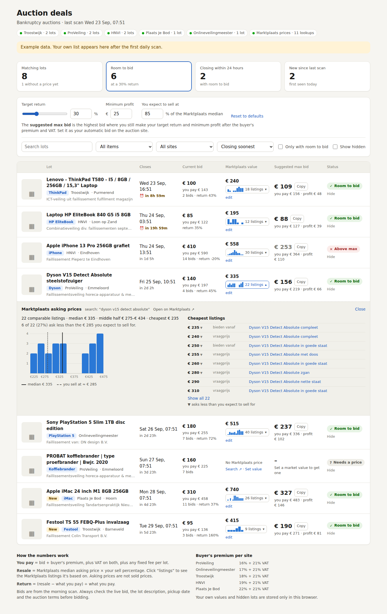

# Auction deal bot

Once a day this bot checks Dutch **bankruptcy auctions** (faillissementsveilingen) for the items on your watchlist. It looks up what each match sells for on **Marktplaats** and puts everything on a **dashboard** with a **suggested maximum bid** for the return you want. Every morning you also get a short **Telegram** summary.

| Site | What it checks |
|---|---|
| Troostwijk Auctions | Auctions with "faillissement" in the name, lots in the Netherlands |
| ProVeiling | Faillissementsveilingen |
| HNVI veilingen | Auctions held for a curator (bankruptcy trustee) |
| Plaats Je Bod | Faillissementsveilingen |
| Onlineveilingmeester | Auctions of type *Faillissement* |

It runs for free on GitHub, so your laptop can stay off. Each auction site is visited **once a day**, around 06:15, at about one page every 1.5 seconds.

---

## Setup (about 20 minutes)

### 1. Create your Telegram bot

1. In Telegram, open a chat with **@BotFather** and send `/newbot`.
2. Pick a name, for example *Veiling Deals*, and a username ending in `bot`, for example `diede_veiling_bot`.
3. BotFather replies with a **token** that looks like `7412345678:AAH...`. Copy it.
4. Open the chat with your new bot and press **Start**, or send it any message.

### 2. Put the code on GitHub

1. Create a free account at [github.com](https://github.com) if you don't have one yet.
2. Click **+ → New repository**. Name it `auction-deals`, choose **Public**, and click **Create repository**.
   The repository must be public for the free dashboard link. Your Telegram token stays secret, but anyone who finds the repository or the link can see your watchlist and the lot list.
3. On the new repository page, click **uploading an existing file**.
4. Unzip `auction-deals.zip`. Drag **everything inside** the `auction-deals` folder into the browser, including the `.github` folder, then click **Commit changes**.
5. Check that the folder `.github/workflows` contains `scan.yml` and `commands.yml`. If it's missing, create each file with **Add file → Create new file**, for example `.github/workflows/scan.yml`, and paste in the contents.

### 3. Settings

1. **Settings → Secrets and variables → Actions → New repository secret.** Name: `TELEGRAM_BOT_TOKEN`. Value: the BotFather token.
2. **Settings → Actions → General → Workflow permissions.** Choose **Read and write permissions** and click **Save**.
3. **Settings → Pages → Build and deployment → Source.** Choose **GitHub Actions**. This turns on the dashboard.

### 4. Get your chat ID

1. Open the **Actions** tab. If GitHub asks, click **I understand my workflows, go ahead and enable them**.
2. Click **Telegram commands → Run workflow → Run workflow**.
3. Within a minute, your bot sends *"Your chat ID is 123456789"*.
4. Add a second secret with name `TELEGRAM_CHAT_ID` and that number as the value.

### 5. First scan

1. Click **Scan auctions → Run workflow → Run workflow**. It takes about 5 minutes.
2. You get the morning summary in Telegram, including the link to your dashboard: `https://<your-github-name>.github.io/auction-deals/`. Bookmark it or add it to your phone's home screen.

From now on the scan runs every morning by itself.

---

## The dashboard



Each row is a lot from a running bankruptcy auction that matches your watchlist:

| Column | What it shows |
|---|---|
| **Lot** | Title (click it to open the lot on the auction site), your watchlist item, site, location and auction name. **New** means it appeared since the last scan. |
| **Closes** | Closing time in Dutch time, highlighted when it's within 24 hours |
| **Current bid** | Bid at the time of the scan, what you would pay including premium and VAT, and the return at that price |
| **Marktplaats value** | Median asking price of comparable listings, with a small bar chart of how the prices are spread. *edit* lets you type your own value. |
| **Suggested max bid** | The highest bid that still gives your target return. **Copy** it into the auto-bid (automatisch bieden) field on the auction site. |
| **Status** | ✓ *Room to bid* (current bid is below your max), ✕ *Above max*, or ? *Needs a price* (set a value yourself) |

At the top you set:

- **Target return**: the profit you want as a share of what you pay. With 30%, you pay at most €100 for something you expect to sell for €130.
- **Minimum profit**: also at least this many euros per lot, so cheap items are worth the trip.
- **You expect to sell at**: the share of the Marktplaats median you realistically get. Default 85%, because asking prices are higher than selling prices.

Every max bid updates as soon as you change these. **Hide** removes lots you're not interested in. Your own values, hidden lots and settings are saved in that browser only.

**Price spread.** Click the small bar chart (*22 listings ▾*) to open a histogram of all comparable Marktplaats asking prices. It marks the median and the price you expect to sell for, tells you how many listings ask less than that, and lists the cheapest listings with links. If most bars sit on the low side, many sellers undercut the median, so expect to sell lower or wait longer. Outliers, such as a €9.999 joke listing, are left out and named below the chart.

## Telegram

Every morning you get a summary like this:

```
☀️ Auction scan · Wed 23 Sep
8 matching lots · 6 with room to bid · 3 new
Max bids for a 30% return and at least €25 profit

⏰ Closing within 24 hours
• Lenovo ThinkPad T580 i5 8GB 256GB
   bid €100 → max €108 · Troostwijk · Wed 16:40

🆕 New with room to bid
• Festool TS 55 FEBQ-Plus invalzaag
   bid €95 → max €183 · Troostwijk · Tue 07:40

📊 Open the dashboard
```

You manage your watchlist by sending the bot commands. It reads them every 15 minutes, which never touches the auction sites.

| Command | What it does |
|---|---|
| `/add iphone 15 pro -hoesje -case` | Watch an item. Words starting with `-` exclude lots, for example accessories. |
| `/add playstation 5 \| ps5 -controller` | Use `\|` to give alternative search phrases. |
| `/add dyson v15 max=250` | Never suggest paying more than €250 in total (bid + premium + VAT). |
| `/add festool price=400` | Use your own resale value of €400 instead of Marktplaats. |
| `/add rolex profit=500` | Minimum profit for this item only. |
| `/add ps5 mp="playstation 5 disc edition"` | Use this exact Marktplaats search for the price. |
| `/list` · `/remove 3` | Show the watchlist, or stop watching an item (by number or name). |
| `/return 35` | Target return for the suggested max bids, in % |
| `/minprofit 30` | Minimum profit per lot, in € |
| `/scan` | Scan now instead of waiting for tomorrow (at most 3 extra scans a day) |
| `/dashboard` · `/status` · `/help` | Dashboard link, whether every site worked in the last scan, all commands |

You can also edit `watchlist.yml` directly on GitHub. The comments at the top of that file explain every field.

---

## How the numbers work

1. **You pay** = (bid + buyer's premium) × 1.21 VAT. The premium per site is set in `config.yml`:

   | Site | Premium |
   |---|---|
   | ProVeiling | 16% |
   | Onlineveilingmeester | 17% |
   | Troostwijk | 18%. This is an estimate, because Troostwijk sets it per auction. Check the lot page. |
   | HNVI | 19% |
   | Plaats Je Bod | 22% |

2. **Marktplaats value**: the bot searches Marktplaats using the watchlist keyword plus up to three words from the lot title. The words after the keyword, usually the model, are kept longest. For example, "Lenovo ThinkPad T580 i5 8GB" is searched as `thinkpad t580 i5 8gb`. If fewer than 4 comparable listings turn up, it drops words until it finds enough. It skips wanted ads, defect or broken items, parts and accessories, removes outliers, and takes the median asking price.
3. **Expected sale** = Marktplaats value × 85%.
4. **Suggested max bid** = the highest bid where (expected sale − what you pay) ÷ what you pay is at least your target return, and the profit is at least your minimum. If you set `max=` for an item, it never goes above that either.

---

## Good to know

- **Bids change during the day.** The dashboard shows the bids from the morning scan. The max bid is what matters: set it as your auto-bid and the auction site bids for you up to that amount.
- **Marktplaats shows asking prices, not sold prices.** Click *listings* to check what the value is based on before you bid.
- **Lots with several items**, for example "partij" or "9x", are compared with the price of a single item. Read the lot description.
- **Also check** the pickup location and date, whether the lot is sold as-is, and the auction's own terms. Some lots have extra fees or use the margin scheme (margeregeling).
- **Marktplaats is checked sparingly**: each lot's price is reused for 3 days (`cache_days` in `config.yml`), with at most 40 searches per scan, 4–7 seconds apart. If Marktplaats shows its "Toegang is tijdelijk beperkt" block page, the bot stops asking for the rest of that scan and shows the last saved price, with the date it was checked.
- **Being polite to the sites**: one scan a day at a slow pace is a tiny load compared to hourly checking. If you find that a site's terms don't allow automated reading at all, turn it off in `config.yml` (`enabled: false`).
- **Site problems**: if a site fails 2 daily scans in a row, the bot warns you in Telegram and tells you when it works again. The dashboard header shows each site's status too.
- The bot never bids for you.

## Troubleshooting

| Problem | Fix |
|---|---|
| GitHub shows "Toegang is tijdelijk beperkt" or blocks sign-up | Use your normal browser with ad/script blockers and VPN switched off, or try on your phone's mobile data. Wait an hour and try again. If it keeps happening, contact GitHub support with the ID on the page. |
| No Telegram message | Check the `TELEGRAM_BOT_TOKEN` secret and that you pressed **Start** in the bot chat. Open the run in **Actions** and read the log. |
| **Publish dashboard** fails | Set **Settings → Pages → Source** to **GitHub Actions** and run the scan again. |
| Dashboard link gives 404 | The first publish can take a few minutes. Check that the repository is public. |
| A run fails at **Save** | Set **Settings → Actions → General → Workflow permissions** to **Read and write**. |
| The bot doesn't react | Commands are read every 15 minutes, and GitHub sometimes starts scheduled runs late. Check that `TELEGRAM_CHAT_ID` is set. |
| Too many or too few lots with room to bid | Change the target return (`/return`) or minimum profit (`/minprofit`), or add `-words` to exclude accessories. |

## Running it on your own computer (optional)

```
pip install -r requirements.txt pytest
python -m scanner scan --dry-run      # prints the Telegram summary instead of sending it; the dashboard is written to site/index.html
python -m pytest                      # runs the tests
```
