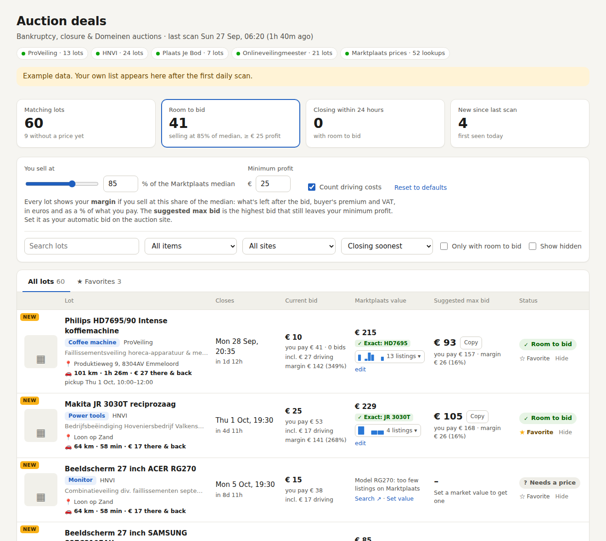

# Auction deal bot

Once a day this bot checks Dutch and Flemish **bankruptcy** (faillissement), **business-closure** (bedrijfsbeëindiging) and **estate** (nalatenschap, inboedel) auctions and **Domeinen Roerende Zaken** government sales for the items on your watchlist. It looks up what **that exact model** sells for on **Marktplaats**, works out the **driving costs** to the pickup address, and puts everything on a **dashboard** with your margin per lot and a **suggested maximum bid**. Every morning you get a short **Telegram** summary, and lots you star as **favorites** get a reminder on the day they close and about an hour before.

| Site | What it checks |
|---|---|
| Troostwijk Auctions | **Not visited**: Troostwijk refuses automated visitors (HTTP 403). Instead the bot reads Troostwijk's own emails from a separate mailbox, see [Troostwijk via alert emails](#8-troostwijk-via-alert-emails-optional). |
| ProVeiling | Faillissements- and bedrijfsbeëindigingsveilingen |
| HNVI veilingen | Auctions held for a curator (bankruptcy trustee) and business closures |
| Plaats Je Bod | Faillissements- and bedrijfsbeëindigingsveilingen |
| Onlineveilingmeester | Auctions of type *Faillissement*, business closures, and *Domeinen Roerende Zaken* (government sales of seized goods and surplus, shown as "Domeinen · …"). Add `OVERHEID` in `config.yml` to include municipalities and water boards too. |
| Veilingwinnaar | Closing restaurants, bakeries, butchers and gyms (*stopzetting*, *wegens bedrijfsbeëindiging*): mostly horeca equipment. Only the town is given, so the trip is an estimate. |
| Inventarisveilingen | IT, office and warehouse inventory sold for curators (*uit een faillissement*), in Nieuwegein. No buyer's premium. Lots without bids show no price; the starting price is on the lot page. |
| Nedveiling | Mostly weekly overstock auctions, which are skipped; only auctions whose name or description mentions a bankruptcy, closure or estate are read, so most weeks this adds nothing. |
| Openbare Verkopen (BE) | openbare-verkopen.be in Flanders: auctions whose name or description mentions a bankruptcy (*faillissement*, *faling*, curator), closure (*stopzetting*) or liquidation. Pickup addresses are in Belgium, so add `HOME_ADDRESS_2` if you're often there (see step 4). |
| Vlavem (BE) | vlavem.com: closures (*stopzettingsveiling*), estates (*afkomstig uit nalatenschap*) and household contents (*inboedel*). Its many auctions of new overstock are skipped. |
| BellAuction (BE) | bellauction.be (Waregem): closing shops, restaurants and workshops (*stopzetting*, *inboedel*, *uitruiming*). |

Which auctions count is set by `auction_keywords` in `config.yml`; a word counts anywhere in the auction's name (and, on most sites, its description), so *boedel* also finds *inboedel*.

**IT auctions (trial).** `extra_auctions` in `config.yml` also lets in ordinary IT auctions, without a bankruptcy: auctions whose **name** has a word like *IT*, *ICT*, *computer*, *laptop*, *monitor*, *beeldscherm*, *hardware*, *Apple*, *MacBook*, *telefoon*, *smartphone* or *GSM* (ex-lease laptops, Troostwijk's "Computers, Tablets, ..."). Expect thinner margins there: refurbishers and traders bid on them too, and laptops and iPads often come without chargers or are locked to a company account (MDM/iCloud). Set `enabled: false` under `extra_auctions` to stop.

**Nothing from before 2020 for Apple, laptops and phones.** These resell poorly (Macs only from Apple Silicon, M1, late 2020), so lots on the MacBook, iPad, Laptop and Phone items that are older than 2020 are left out entirely, not shown on the dashboard or in Telegram (the morning summary says how many). The year comes from the lot title or description: a year ("MacBook Pro 2017"), the chip (M1 and later; an Intel Mac without a year counts as old; i5-8250U = 8th gen = 2018), or the model (iPhone 11, Galaxy S10, Pixel 4, ThinkPad T480, Latitude 5490, EliteBook 840 G6, Surface Pro 7). Lots that don't say how old they are ("Laptop HP", "MacBook Pro") stay. Change `min_year` or set `enabled: false` under `age_filter` in `config.yml`.

**Nothing with a defect.** Lots whose title or own description says they're damaged, broken, don't work, are for parts or are locked (*defect*, *kapot*, *beschadigd*, *schade*, *barst*, *gebroken*, *werkt niet*, *voor onderdelen*, *iCloud locked*, and the same in English and French) are left out entirely; the morning summary says how many. Not when it's negated (*geen schade*, *niet beschadigd*), hypothetical (*eventuele defecten*) or about the box (*doos beschadigd*), and not for the auction house's standard text after the lot's own description. Scratches (*krassen*) and *niet getest* don't count. Set `hide_defects: false` under `condition` in `config.yml` to see them again.

It runs for free on GitHub, so your laptop can stay off. Each auction site is visited **once a day**, around 06:15, at about one page every 1.5 seconds.

---

## Setup (about 20 minutes)

### 1. Create your Telegram bot

1. In Telegram, open a chat with **@BotFather** and send `/newbot`.
2. Pick a name, for example *Veiling Deals*, and a username ending in `bot`, for example `diede_veiling_bot`.
3. BotFather replies with a **token** that looks like `7412345678:AAH...`. Copy it.
4. Open the chat with your new bot and press **Start**, or send it any message.

### 2. Put the code on GitHub

1. Create a free account at [github.com](https://github.com) if you don't have one yet.
2. Click **+ → New repository**. Name it `auction-deals`, choose **Public**, and click **Create repository**.
   The repository must be public for the free dashboard link. Your Telegram token stays secret, but anyone who finds the repository or the link can see your watchlist and the lot list.
3. On the new repository page, click **uploading an existing file**.
4. Unzip `auction-deals.zip`. Drag **everything inside** the `auction-deals` folder into the browser, including the `.github` folder, then click **Commit changes**.
5. Check that the folder `.github/workflows` contains `scan.yml` and `commands.yml`. If it's missing, create each file with **Add file → Create new file**, for example `.github/workflows/scan.yml`, and paste in the contents.

### 3. Settings

1. **Settings → Secrets and variables → Actions → New repository secret.** Name: `TELEGRAM_BOT_TOKEN`. Value: the BotFather token.
2. **Settings → Actions → General → Workflow permissions.** Choose **Read and write permissions** and click **Save**.
3. **Settings → Pages → Build and deployment → Source.** Choose **GitHub Actions**. This turns on the dashboard.

### 4. Your address, for driving costs (optional)

Add another secret: name `HOME_ADDRESS`, value your street, house number and town, for example `Dorpsstraat 1, Veghel`. It stays a secret: it is never written to the repository or the dashboard. Without it, the dashboard shows the pickup addresses but no distances or driving costs.

Often somewhere else too, for example in Belgium? Add a second secret `HOME_ADDRESS_2`, for example `Veldstraat 1, Gent, België` (write the country for an address outside the Netherlands). Each lot then gets the trip from whichever address is closer, shown as "… there & back from Gent".

### 5. Get your chat ID

1. Open the **Actions** tab. If GitHub asks, click **I understand my workflows, go ahead and enable them**.
2. Click **Telegram commands → Run workflow → Run workflow**.
3. Within a minute, your bot sends *"Your chat ID is 123456789"*.
4. Add another secret with name `TELEGRAM_CHAT_ID` and that number as the value.

### 6. First scan

1. Click **Scan auctions → Run workflow → Run workflow**. It takes about 5–10 minutes.
2. You get the morning summary in Telegram, including the link to your dashboard: `https://<your-github-name>.github.io/auction-deals/`. Bookmark it or add it to your phone's home screen.

From now on the scan runs every morning by itself.

### 7. Favorites (once per device)

Click **☆ Favorite** on any lot on the dashboard. The first time, the dashboard asks for a GitHub token so it can save your favorites; its link fills in almost everything:

1. Click **Create the token on GitHub**. Name, 1-year expiry and **Issues: Read and write** are filled in.
2. Under **Repository access**, choose **Only select repositories** and pick **auction-deals**.
3. Click **Generate token**, copy it and paste it into the dashboard.

Your favorites are kept in one issue in your repository (you'll see it under **Issues**), so they show on your phone and laptop alike, and the bot can remind you. The token can only edit issues of this repository; it can't change code or settings. Do the same once on each device you use. After a year GitHub expires the token and the dashboard asks for a new one.

### 8. Troostwijk via alert emails (optional)

The bot never visits Troostwijk. It reads the emails Troostwijk sends you, from a separate mailbox, and puts the lots in them on the dashboard with a Marktplaats price and a max bid. The lots come from Troostwijk's auction emails (a new auction with a few of its lots).

1. **A separate Gmail address for the bot**, for example `veilingbot.jouwnaam@gmail.com`. Turn on 2-step verification for it (Google account → Security), then create an app password at [myaccount.google.com/apppasswords](https://myaccount.google.com/apppasswords) (name it "auction bot"). Google shows 16 letters: that's the app password.
2. **Troostwijk searches**: on the dashboard, under *Troostwijk searches*, open each search, log in on Troostwijk and save it. In your Troostwijk account, under *Account → Communication preferences*, make sure search alerts are on.
3. **Forward the alerts** from your own mailbox to the bot address. In Gmail: *Settings → Forwarding and POP/IMAP → Add a forwarding address* (Gmail sends a code to the bot address; log in there to get it). Then make a filter: search `from:troostwijk`, click *Create filter*, tick *Forward it to* the bot address.
4. **Two secrets on GitHub**: `ALERTS_EMAIL` = the bot address, `ALERTS_APP_PASSWORD` = the app password. (Another provider than Gmail: add `ALERTS_IMAP_HOST` too.)

From the next scan, Troostwijk lots from those emails show up on the dashboard, with the auction's name, place and closing day when the email has them (Troostwijk auction emails give the closing day but not the time: lots close one after another that day, the exact time is on the lot page). The bid is the one in the email, so it may be outdated; the max bid is what counts. Lots stay on the dashboard until they close, or 14 days after the last alert if the email doesn't say when they close. The bot only reads the mailbox and never stores the emails themselves.

You can also forward a Troostwijk email by hand (for example an auction announcement) to the bot mailbox: the next scan picks it up.

**Saved searches give links, not lots.** Troostwijk's weekly *Je opgeslagen zoekopdrachten* email only says which searches have new lots, with a link per search to Troostwijk's search page. The bot doesn't visit Troostwijk, so it can't price those lots. Instead the morning summary shows the search words as links (🔎 *Troostwijk has new lots for your saved searches*), once per email: tap one to look yourself.

**The bid in the email is old.** Troostwijk's emails show the bid when the email was sent, usually the starting bid (€10), while the lot may be at €900 by now. The bot can't see the current bid (it never visits Troostwijk), so these lots get **Check current bid** instead of *Room to bid*: open the lot and bid only if the current bid is below the max bid. New ones are listed in the morning summary under *New from Troostwijk emails*.

**The same auctions as on the other sites**: lots whose auction name has a word from `auction_keywords` (faillissement, curator, bedrijfsbeëindiging, ...) or, while the IT trial is on, from `extra_auctions` (so "Computers, Tablets, Desktops, ..." counts). Set `only_bankruptcy: false` under `troostwijk_alerts` in `config.yml` to see all of Troostwijk's auctions.

All links in Troostwijk's emails go through their mailing service's tracking links. The bot reads where each link goes from the link itself, so it doesn't "click" anything: no clicks are registered on your account and unsubscribe links are never opened.

If the morning summary says it couldn't find lots in a Troostwijk email, their email layout is new to the bot: save that email as a file (Gmail: ⋮ → *Download message*) and share it so the bot can learn it.

---

## The dashboard



Each row is a lot from a running bankruptcy auction that matches your watchlist. Lots that are **new since the last scan** come first, with a small **NEW** label in the top-left corner.

| Column | What it shows |
|---|---|
| **Lot** | Title (click it to open the lot on the auction site), your watchlist item, site and auction name. Below that: 📍 the **pickup address** (ophaallocatie), 🚗 the distance, driving time and fuel costs there and back, and the pickup day. |
| **Closes** | Closing time in Dutch time, highlighted when it's within 24 hours |
| **Current bid** | Bid at the time of the scan, what you would pay including premium, VAT and driving, and your **margin** at that price (in € and as a % of what you pay) |
| **Marktplaats value** | Median asking price, with a small bar chart of how the prices are spread. **✓ Exact: S27C366EAU** means only listings of that exact model were compared. **≈ Rough price** means the lot title has no type number, so similar items were compared: check it yourself. Lots like "40x Colbert" count all items (40 × the price of one). *edit* lets you type your own value. |
| **Suggested max bid** | The highest bid that still leaves your minimum margin, with the margin you'd make at that bid. **Copy** it into the auto-bid (automatisch bieden) field on the auction site. |
| **Status** | ✓ *Room to bid* (current bid is below your max), ✕ *Above max*, or ? *Needs a price* (set a value yourself). **☆ Favorite** stars the lot, **Hide** hides it. |

The **Favorites** tab shows the lots you starred, also after they closed or dropped out of the scan.

At the top you set:

- **You sell at**: the share of the Marktplaats median you expect to get. The default is 85%, because asking prices are higher than selling prices. Drag it to 50% to see your margin if you only get half the median.
- **Minimum margin**: the suggested max bid always leaves at least this margin, as a % of what you pay (bid, premium, VAT and driving). At 30% you pay at most your sale price ÷ 1.3. The default is 30%.
- **Count driving costs**: include the drive to the pickup address in what you pay (on by default).

Every margin and max bid updates as soon as you change these. **Hide** removes lots you're not interested in. Your own values, hidden lots and settings are saved in that browser only.

**Price spread.** Click the small bar chart (*22 listings ▾*) to open a histogram of all comparable Marktplaats asking prices. It marks the median and the price you expect to sell for, tells you how many listings ask less than that, and lists the cheapest listings with links. If most bars sit on the low side, many sellers undercut the median, so expect to sell lower or wait longer. Outliers, such as a €9.999 joke listing, are left out and named below the chart.

## Telegram

Every morning you get a summary like this:

```
☀️ Auction scan · Mon 28 Sep
60 matching lots · 12 with room to bid · 2 new
Max bids for selling at 85% of the Marktplaats median with at least 30% margin

⭐ Your favorites closing today
• Philips HD7695/90 Intense koffiemachine
   bid €10 · your max €93 · closes 20:35
I'll remind you again about an hour before each one closes.

⏰ Closing within 24 hours
• Beeldscherm 27 inch SAMSUNG S27C310EAU
   bid €15 → max €41 (margin €19 · 30%) · HNVI · Mon 19:30 · 🚗 64 km

📊 Open the dashboard
```

About an hour before a favorite closes you get:

```
⏰ Closes in 52 min (20:35)
⭐ Philips HD7695/90 Intense koffiemachine
bid this morning €10 · your max €93
📍 Produktieweg 9, 8304AV Emmeloord · 101 km
```

You manage your watchlist by sending the bot commands. It reads them every 5 minutes, which never touches the auction sites.

| Command | What it does |
|---|---|
| `/add iphone 15 pro -hoesje -case` | Watch an item. Words starting with `-` exclude lots, for example accessories. |
| `/add playstation 5 \| ps5 -controller` | Use `\|` to give alternative search phrases. |
| `/add dyson v15 max=250` | Never suggest paying more than €250 in total (bid + premium + VAT). |
| `/add festool price=400` | Use your own resale value of €400 instead of Marktplaats. |
| `/add rolex margin=50` | Minimum margin for this item only, in %. |
| `/add ps5 mp="playstation 5 disc edition"` | Use this exact Marktplaats search for the price. |
| `/list` · `/remove 3` | Show the watchlist, or stop watching an item (by number or name). |
| `/sellat 50` | What you expect to sell for, as a % of the Marktplaats median |
| `/minmargin 30` | The max bid always leaves at least this margin: profit as a % of what you pay |
| `/scan` | Scan now instead of waiting for tomorrow (at most 3 extra scans a day) |
| `/favorites` | The lots you starred on the dashboard, with their closing times |
| `/dashboard` · `/status` · `/help` | Dashboard link, whether every site worked in the last scan, all commands |

You can also edit `watchlist.yml` directly on GitHub. The comments at the top of that file explain every field.

---

## How the numbers work

1. **You pay** = (bid + buyer's premium) × 1.21 VAT + driving costs, for the **bid you'd have to place now**: the starting bid while nobody has bid, else the current bid plus one step. Onlineveilingmeester and Plaats Je Bod say the step per lot; for the other sites the usual steps are used (€1 below €20, €5 up to €100, €10 up to €500, €25 up to €1,000, €50 up to €5,000, then €100; `bidding.steps` in `config.yml`), shown as "next bid ≈ €75". A lot has room to bid while that next bid is at most your max bid. Inventarisveilingen shows €0 until someone bids, so the bot reads the starting price on the lot page of the lots on your watchlist. The premium per site is set in `config.yml`:

   | Site | Premium |
   |---|---|
   | ProVeiling | 16% |
   | Onlineveilingmeester | 17%; Domeinen lots 10%. Margin-scheme lots 21% (Domeinen 12.1%) incl. VAT, set per lot automatically. |
   | Troostwijk | 18%. This is an estimate, because Troostwijk sets it per auction. Check the lot page. |
   | HNVI | 19% |
   | Plaats Je Bod | 22% |
   | Veilingwinnaar | 18% |
   | Inventarisveilingen | none (only 21% VAT on the bid) |
   | Nedveiling | 15% |
   | Openbare Verkopen (BE) | 19% (17% or 19% depending on the lot; check the lot page) |
   | Vlavem (BE) | 17%. VAT is only charged on the 17% for used goods; the bot counts it on the bid too, to be safe. |
   | BellAuction (BE) | 17% |

2. **Marktplaats value**:
   - **Exact model**: when the lot title has a type number, only listings of that model count. "Curved beeldscherm 27 inch SAMSUNG S27C366EAU" is searched as `samsung s27c366eau`, and a listing must contain S27C366EAU (also written with spaces or dashes). Sizes, memory, voltages and processors (27 inch, 8GB, 18V, i5) are not type numbers. Two listings of the same model are enough. If Marktplaats has fewer, the lot shows *too few listings* and you can set a value yourself.
   - **Rough price**: without a type number, the bot compares the category, brand and a few words from the title, for example `monitor lenovo` (monitor and beeldscherm count as the same). It needs at least 4 listings. A brand or category alone (`hilti`, `monitor`) is never used.
   - **Type number in the description**: when the title has none ("2 x Dell 24 inch monitor"), the bot reads the lot's description ("… monitor type U2419 HC") once from the lot page and uses that type number, shown as "type number from the lot description". The description of every lot on your watchlist is read (lots without a type number in the title first, then the ones closing soonest), also to spot defects and storage. At most 80 new lot pages per scan (`descriptions` in `config.yml`); not for Troostwijk, Onlineveilingmeester and BellAuction, whose lot pages it can't read (their descriptions come with the lot list, except Troostwijk's).
   - **Storage, memory and 5G**: what the lot says about its version, in the title or else its description, is searched too: a "Samsung Galaxy A12" with description "64 GB" is searched as `galaxy a12 64gb`, and listings that say 64 GB count first; with too few of those, all Galaxy A12 listings. Storage for phones and tablets, memory (RAM) for laptops and Macs, 5G for phones.
   - **Macs**: told apart by line, chip and screen size ("MacBook Pro 16 M1 Max"), and memory when enough listings name the same amount (32 GB). Intel Macs are compared with the same processor (an i7 with i7s, not i9s) and get a rough price, as storage and years vary.
   - **iPads**: told apart by line (iPad, Air, mini, Pro), generation, chip or year, and screen size: "iPad 6th Gen." is compared with plain iPads of the 6th generation or 2018 (not Pro, Air or mini), "iPad Pro 10,5 inch" with iPad Pro 10.5 listings.
   - **Accessories don't count**: listings for a keyboard, case (hoes, Incipio, OtterBox, …), screen protector, pencil, dock, converter or parts, "voor iPad" / "voor Einhell" / "geschikt voor", and non-original batteries (*huismerk*, *vervangend*) are left out, unless the lot itself is such a thing. "Zonder accu" in a listing doesn't make it an accu listing.
   - **HP and Lenovo laptops and PCs**: told apart by line, model and generation, and screen size when given: "ZBook Firefly G10 14”" is compared with ZBook Firefly 14 G10 listings only, not a ZBook Fury 16 G10; "EliteBook 840 G5" with EliteBook 840 G5; "ThinkPad T14 Gen 2" with T14 Gen 2 (also written G2). When only the description has it ("Laptop Lenovo ThinkBook" + "type: 15 g2 itl"), the line comes from the title and size and generation from the description: ThinkBook 15 G2, not a ThinkBook 14s Yoga or 15 G3.
   - **Batteries**: a lot that is a battery (with or without charger) is compared with batteries of the same voltage ("makita accu 12v"), not with drills that come with one.
   - It skips wanted ads, defect items, parts, accessories and auction houses advertising their own lots, removes outliers, and takes the median asking price.
3. **Sale price** = Marktplaats value × your sell percentage (85% by default) × the number of items when the title says so: "40x Colbert", "2 x ...", "Twee ...", "(40 stuks)" or "Colberts x40". Sizes like "180 x 90 cm" don't count. The dashboard shows it as "40 × €20". To count big bulk lots as one item instead, set `max_items_per_lot` in `config.yml`.
4. **Driving costs** = distance there and back ÷ 16 km per liter × the Belgian maximum price for Euro 95 E10, read every morning. The pickup address comes from the auction page; distances come from the OSRM route planner (OpenStreetMap). Change the fuel use, price or leave out driving costs in `config.yml` under `driving`. **Lots at one pickup share the trip**: lots collected at the same address on the same pickup day split the trip cost between the lots worth collecting there (room to bid, a bid to check, or a favorite), so three lots 70 minutes away each carry a third of the fuel. The bot looks for the largest group that is worth it together, so lots that can't pay for the trip alone can together. It assumes you win them all: win only one and that one carried the whole trip.
   **How far for how many lots** (`driving.trip_rules` in `config.yml`, one way, from the closer of your addresses): up to 30 minutes for any lot, up to 1.5 hours when at least 3 lots there (same address and pickup day) have room to bid, need a bid check (Troostwijk) or are favorites, up to 2 hours for more than 5 such lots. Lots that don't make it are hidden on the dashboard (tick *Show hidden* to see them, marked "Too far for 2 lots" or "Over 2h 00m away") and left out of the morning summary; Favorites are never hidden.
   **Further than 2 hours: transport.** Those lots aren't hidden but priced as if a transporter (e.g. Brenger) brings them: a rough estimate of €75 for one lot plus €25 for each extra lot from the same address and pickup day, split over the lots worth collecting there ("🚚 too far to drive: transport ≈ €100 for 2 lots"). Adjust the estimate under `driving.transport` in `config.yml` once you have a real quote, or set `enabled: false` to hide those lots instead (they then also get no Marktplaats search).
5. **Margin** = sale price − what you pay, also shown as a % of what you pay.
6. **Suggested max bid** = the highest bid that still leaves your minimum margin: what you pay is at most sale price ÷ (1 + minimum margin), so at 30% and a sale price of €130 you pay at most €100. If you set `max=` for an item, it never goes above that either.

---

## Good to know

- **Bids change during the day.** The dashboard shows the bids from the morning scan. The max bid is what matters: set it as your auto-bid and the auction site bids for you up to that amount.
- **Marktplaats shows asking prices, not sold prices.** Click *listings* to check what the value is based on before you bid.
- **Lots with several items**, for example "partij" or "9x", are compared with the price of a single item. Read the lot description.
- **Also check** the pickup location and date, whether the lot is sold as-is, and the auction's own terms. Some lots have extra fees or use the margin scheme (margeregeling).
- **Marktplaats is checked sparingly**: each lot's price is reused for 3 days (`cache_days` in `config.yml`), with at most 60 searches per scan, 4–7 seconds apart. If Marktplaats shows its "Toegang is tijdelijk beperkt" block page, the bot stops asking for the rest of that scan and shows the last saved price, with the date it was checked.
- **Being polite to the sites**: one scan a day at a slow pace is a tiny load compared to hourly checking. If you find that a site's terms don't allow automated reading at all, turn it off in `config.yml` (`enabled: false`).
- **Site problems**: if a site fails 2 daily scans in a row, the bot warns you in Telegram and tells you when it works again. The dashboard header shows each site's status too.
- **Your address and the public dashboard**: `HOME_ADDRESS` (and `HOME_ADDRESS_2`) are GitHub secrets and never appear in the repository, but the dashboard (which is public) shows the distance from your home to each pickup address, and with two addresses the town of the second one ("from Gent").
- **Reminders** come from the Telegram job that runs every 5 minutes, so they arrive 55–60 minutes before closing (GitHub sometimes starts it a few minutes late). Closing times are from the morning scan; auction sites can extend a lot when someone bids at the last minute.
- The bot never bids for you.

## Troubleshooting

| Problem | Fix |
|---|---|
| GitHub shows "Toegang is tijdelijk beperkt" or blocks sign-up | Use your normal browser with ad/script blockers and VPN switched off, or try on your phone's mobile data. Wait an hour and try again. If it keeps happening, contact GitHub support with the ID on the page. |
| No Telegram message | Check the `TELEGRAM_BOT_TOKEN` secret and that you pressed **Start** in the bot chat. Open the run in **Actions** and read the log. |
| **Publish dashboard** fails | Set **Settings → Pages → Source** to **GitHub Actions** and run the scan again. |
| Dashboard link gives 404 | The first publish can take a few minutes. Check that the repository is public. |
| A run fails at **Save** | Set **Settings → Actions → General → Workflow permissions** to **Read and write**. |
| The bot doesn't react | Commands are read every 5 minutes, and GitHub sometimes starts scheduled runs late. Check that `TELEGRAM_CHAT_ID` is set. |
| Too many or too few lots with room to bid | Change your sell percentage (`/sellat`) or minimum margin (`/minmargin`), or add `-words` to exclude accessories. |
| A site shows "failed" on the dashboard | Send `/status` or open `data/state.json` on GitHub to see the error. *HTTP 403* means the site refuses automated visitors; turn it off in `config.yml`. |
| No distances or driving costs | Check the `HOME_ADDRESS` secret (street, number and town). The footer of the dashboard says why when it can't find your address or the route planner. |
| "This token can't edit issues" when starring a lot | The token must have **Only select repositories → auction-deals** and **Issues: Read and write**. Create a new one with the link in the dialog. |
| No Troostwijk lots | Check that Troostwijk's alert emails arrive in the bot mailbox, and the `ALERTS_EMAIL` / `ALERTS_APP_PASSWORD` secrets. A wrong app password shows as "alerts mailbox" in `/status`. |
| No reminder for a favorite | Check that the **Telegram commands** workflow runs (Actions tab) and that the favorite is in the Favorites tab. |

## Running it on your own computer (optional)

```
pip install -r requirements.txt pytest
python -m scanner scan --dry-run      # prints the Telegram summary instead of sending it; the dashboard is written to site/index.html
python -m pytest                      # runs the tests
```
